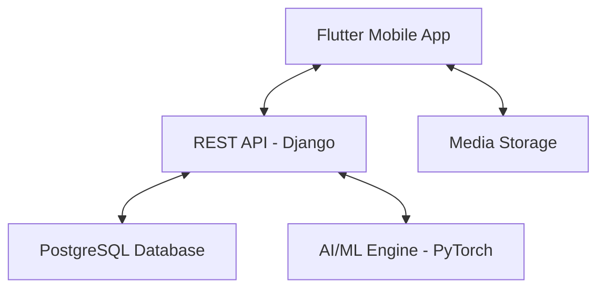

# SAAF SAAF (سعف)
Palm tree variety classification + community app (Flutter + Django + PostgreSQL + PyTorch).

## ✅ Quick start (recommended): Docker
This runs **PostgreSQL + Django backend** with one command.

### Prerequisites
- Docker Desktop

### Run
From the `Saaf/` folder:

```bash
docker compose up --build
```

- **Backend URL**: `http://127.0.0.1:8000/`
- **API base**: `http://127.0.0.1:8000/api/`

### Model file
The model checkpoint is already in `Saaf/` and is mounted into the backend container automatically.

## 🏗 Project Architecture

The system follows a modern client-server architecture:



### 1. Frontend: Flutter Mobile Application
A high-performance, cross-platform UI built to handle image processing and community interactions.
- **State Management**: `Provider` pattern for clean data flow.
- **Localization**: Full support for Arabic and English using `.arb` files.
- **Image Handling**: Custom logic for 1:1 aspect ratio cropping and cross-platform (Web/Mobile/macOS) image uploading.

### 2. Backend: Django REST Framework
A robust backend managing users, posts, and ML inference.
- **Authentication**: Custom JWT implementation for secure, stateless sessions.
- **ML Integration**: The AI model is loaded once on server startup (in `classify/apps.py`) and cached in memory for zero-latency inference.
- **Storage**: Media files (images) are managed through Django's `FileSystemStorage`.

---

## 📂 Directory Structure

### Mobile App (`/lib`)
- `core/`: Constants, themes, and shared utilities (token storage).
- `models/`: Plain Dart objects mapping API data (User, Post, Result).
- `providers/`: Business logic and state management (Auth, Feed, Classification).
- `screens/`: UI components organized by feature (Auth, Feed, Result, Profile).
- `services/`: Low-level HTTP communication classes.
- `l10n/`: Translation files for Arabic and English.

### Backend (`/saaf_backend`)
- `accounts/`: Custom user model, profile management, and JWT authentication logic.
- `feed/`: Social features — posts, likes, and nested comments.
- `classify/`: The AI engine. Ported from a standalone FastAPI implementation into Django views.
- `media/`: Storage directory for uploaded images.
- `saaf/`: Core project settings and URL routing.

---

## 🛠 Setup and Installation

### Option A: Docker (best for teammates)
See the **Quick start** section above.

### Option B: Local (no Docker)
Use this if you want to run everything directly on your machine.

#### 1) Backend (Django)
**Prerequisites**
- Python 3.11+
- PostgreSQL 16+

**Create `saaf_backend/.env`**
> Note: backend settings use `DB_*` variables (not `DATABASE_URL`).

```env
SECRET_KEY=your_secret
DEBUG=True
DB_NAME=saaf_db
DB_USER=postgres
DB_PASSWORD=your_postgres_password
DB_HOST=localhost
DB_PORT=5432
MODEL_PATH=../convnext_tiny_best_on_val_no_kfold_aug_convnext_tiny.pth
```

**Run**
```bash
cd saaf_backend
pip install -r requirements.txt
python manage.py migrate
python manage.py runserver
```

Backend will be at `http://127.0.0.1:8000/`.

#### 2) Frontend (Flutter)
**Prerequisites**
- Flutter SDK

From the `Saaf/` folder:
```bash
flutter pub get
flutter run
```

**Flutter Web (Edge/Chrome) API URL**
- When testing on the same laptop in a browser, set:
  - `lib/core/constants/api_constants.dart` → `baseUrl = 'http://127.0.0.1:8000/api'`

---
## ⚙️ Technical notes

### AI classification logic
The model uses a pre-trained `timm` architecture. To prevent misleading results, the API returns `"Unknown"` if confidence is below 95%. When result is `"Unknown"`, the option to “Share to Community” is disabled in the app.

### Data synchronization
The app uses a “Reload on Tab” strategy. Profile posts are re-fetched whenever the user navigates to the Profile tab so likes/comments stay in sync.

## 📤 Git Workflow

To keep the project clean, specific rules are set in `.gitignore`:
- **Ignored**: `.env` files, `db.sqlite3`, `media/` uploads, and `__pycache__`.

### Pushing Changes
```bash
git add .
git commit -m "feat: your feature description"
git push origin main
```

---
**Main Repository**: [github.com/avdullvh/saaf-saaf](https://github.com/avdullvh/saaf-saaf)
