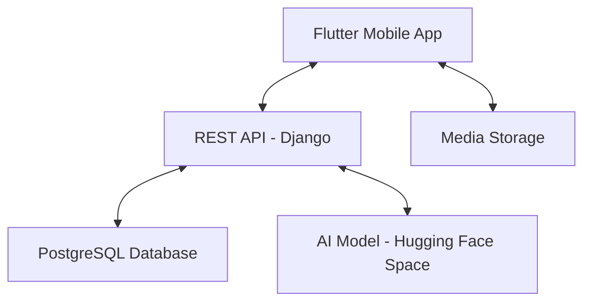

# Saaf (سعف)

Palm tree variety classification and farmer community app — Flutter + Django + PostgreSQL, with AI classification hosted on Hugging Face.

---

## Project Architecture



### Frontend — Flutter Mobile Application
- **State Management**: `Provider` pattern.
- **Localization**: Full Arabic and English support via `.arb` files.
- **Image Handling**: Camera and gallery picking with cross-platform image upload.

### Backend — Django REST Framework
- **Authentication**: Custom JWT (SimpleJWT) for secure, stateless sessions.
- **AI Classification**: Images are forwarded to a hosted Hugging Face Space (`mutairi1-palmtreeclassifer`). No local model file is needed.
- **Social Feed**: Posts, likes, nested comments, and follow relationships.
- **Recommendations**: LightGCN-based "Who to follow" suggestions.
- **Storage**: Media files managed through Django's `FileSystemStorage`.

---

## Directory Structure

### Mobile App (`/lib`)
- `core/` — API constants, theme, and token storage utilities.
- `models/` — Dart data classes (User, Post, ClassificationResult).
- `providers/` — State management (Auth, Feed, Classification, Profile, Theme, Locale).
- `screens/` — UI screens: Auth, Classification, Feed, Profile.
- `services/` — HTTP communication layer.
- `l10n/` — Arabic and English translation files.

### Backend (`/saaf_backend`)
- `accounts/` — Custom user model, JWT auth, profile, follow system, and recommendations.
- `feed/` — Posts, likes, and comments.
- `classify/` — Proxies classification requests to the Hugging Face Space.
- `saaf/` — Django settings and root URL configuration.

---

## Setup and Installation

### Option A: Docker (recommended)

**Prerequisites**
- Docker Desktop installed and running.

**Run** from the `Saaf/` folder:
```bash
docker compose up --build
```

- **Backend**: `http://127.0.0.1:8000/`
- **API base**: `http://127.0.0.1:8000/api/`

> The AI model is hosted on Hugging Face — no local model file needed. The `HF_CLASSIFY_URL` is already set in `docker-compose.yml`.

---

### Option B: Local (no Docker)

#### 1) Backend (Django)

**Prerequisites**
- Python 3.11+
- PostgreSQL 16+

**Create `saaf_backend/.env`**

```env
SECRET_KEY=your_secret_key
DEBUG=True
DB_NAME=saaf_db
DB_USER=postgres
DB_PASSWORD=your_postgres_password
DB_HOST=localhost
DB_PORT=5432
HF_CLASSIFY_URL=https://mutairi1-palmtreeclassifer.hf.space/classify
```

**Install and run**
```bash
cd saaf_backend
pip install -r requirements.txt
python manage.py migrate
python manage.py runserver 0.0.0.0:8000
```

Backend will be at `http://127.0.0.1:8000/`.

> Using `0.0.0.0:8000` makes the backend reachable from physical phones on the same Wi-Fi network.

---

#### 2) Frontend (Flutter) — Web / Emulator

**Prerequisites**
- Flutter SDK installed ([flutter.dev](https://flutter.dev))

```bash
cd Saaf
flutter pub get
flutter run
```

For web or desktop testing, ensure `lib/core/constants/api_constants.dart` has:
```dart
static const String baseUrl = 'http://127.0.0.1:8000/api';
```

---

#### 3) Running on a Physical Device (iPhone or Android)

When testing on a real phone, the app must reach the Django backend over your local network.

**Step 1 — Find your machine's local IP address**

- **Windows**: open Command Prompt → `ipconfig` → look for `IPv4 Address` (e.g. `192.168.1.10`)
- **macOS**: open Terminal → `ifconfig en0` → look for `inet` (e.g. `192.168.1.10`)

**Step 2 — Update the API base URL**

Open `lib/core/constants/api_constants.dart` and replace the IP with yours:

```dart
static const String baseUrl = 'http://192.168.1.10:8000/api';
```

**Step 3 — Run Django on your LAN**
```bash
python manage.py runserver 0.0.0.0:8000
```

**Step 4 — Run the Flutter app on the device**

Connect the phone via USB (or wirelessly) and run:
```bash
flutter run
```

Flutter will detect the connected device. The app will communicate with your machine's Django server over Wi-Fi.

> **iPhone note**: You may need to trust the developer certificate on the device under Settings → General → VPN & Device Management.

> **Android note**: Enable Developer Options and USB Debugging on the device.

---

## Seed Demo Data (optional)

Populates the database with 50 realistic users, posts, follow relationships, and likes.

**Requirements:**
- Backend must be running at `http://127.0.0.1:8000`.
- `feedPhotos/` folder must exist at the repo root with `.jpg` images (already included).

```bash
# From the Saaf/ folder
python saaf_backend/seed_data.py
```

All seeded accounts use the password `Saaf@1234`.

---

## Technical Notes

### AI Classification
Images are sent from the Flutter app → Django backend → Hugging Face Space (`/classify` endpoint). The Hugging Face model returns the predicted palm variety (`Khalas`, `Razeez`, or `Shishi`) and a confidence score.

To prevent misleading results, the result screen shows `"Unknown"` and disables the "Share to Community" button if confidence is below 95%.

### Password Policy
Passwords must be at least 6 characters and contain both letters and numbers. This is enforced both on the frontend (Flutter form validator) and backend (Django serializer).

### Social Recommendation Algorithm
The "People you may know" feature uses a LightGCN graph neural network trained on the follow graph. Details are in `SOCIAL_RECOMMENDATION_ALGORITHM.md`.

### Data Synchronization
The app uses a "Reload on Tab" strategy — profile posts are re-fetched whenever the user opens the Profile tab so likes and comments stay in sync.

---

## Git Workflow

`.gitignore` excludes: `.env` files, `db.sqlite3`, `media/` uploads, `__pycache__`, and build artifacts.


---

**Repository**: [github.com/avdullvh/Saaf](https://github.com/avdullvh/Saaf)
